

<!-- BANNIÈRE PRINCIPALE -->
<!-- 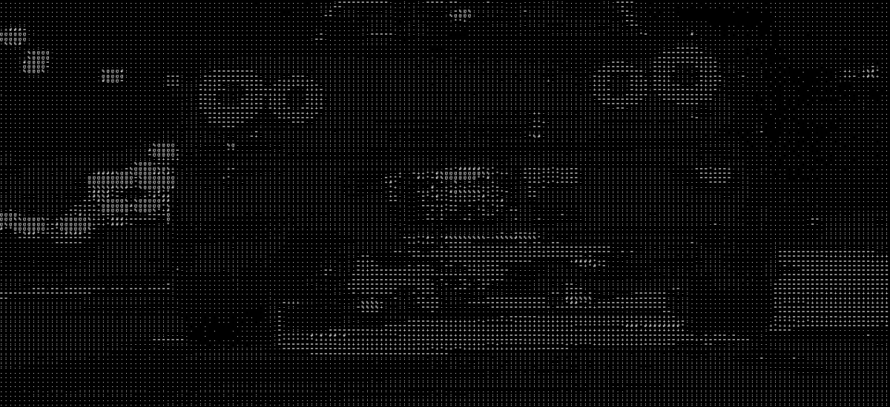 -->

---

<!-- Ici, pas de tableau ! Les GIFs s'adaptent et s'alignent tous seuls en fonction de l'écran. 
     On joue sur des tailles différentes pour donner du rythme. -->

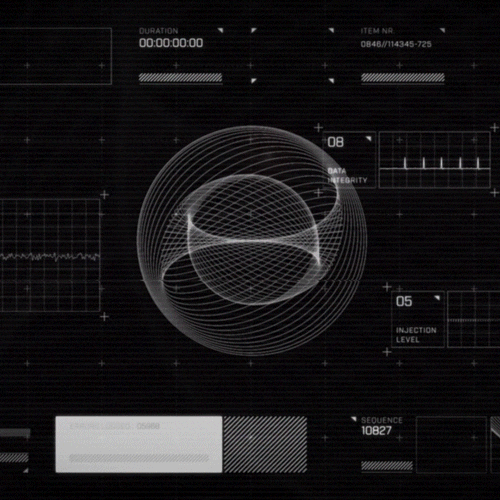
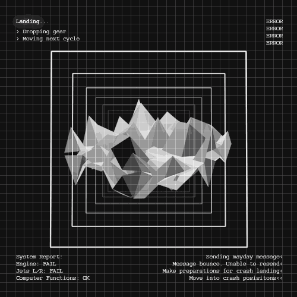
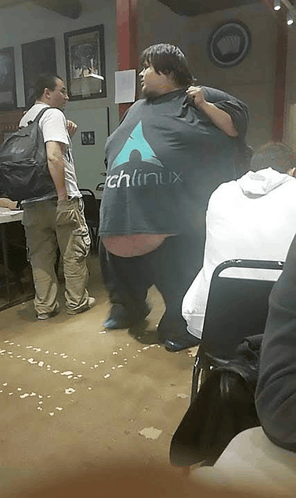
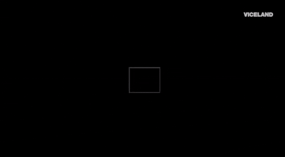
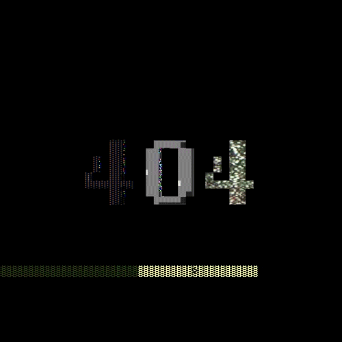
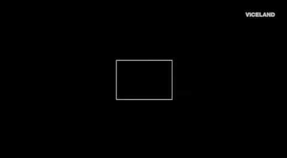
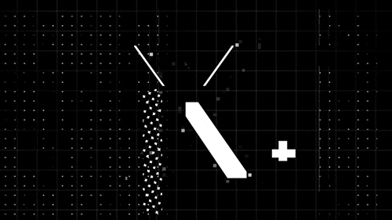

---

## 👾 RETRO POKÉMON SPACE

Parce qu'on ne code jamais seul...

  
  <kbd style="padding: 20px; background-color: #1f242c; border: 1px solid #30363d; border-radius: 10px; display: inline-block; margin: 10px;">
    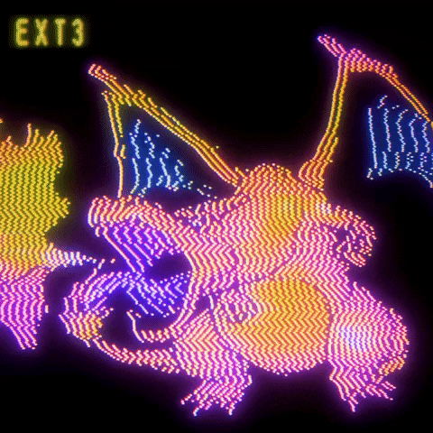
      
    <code>#148 - DRACO</code>
  </kbd>

  <kbd style="padding: 20px; background-color: #1f242c; border: 1px solid #30363d; border-radius: 10px; display: inline-block;">
    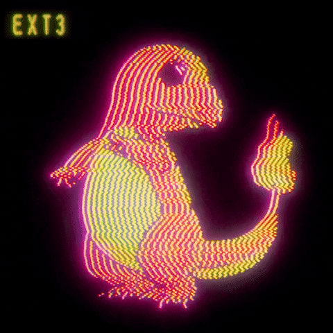
      
    <code>#004 - SALAMÈCHE</code>
  </kbd>

---

## 🎮 Game Console

 
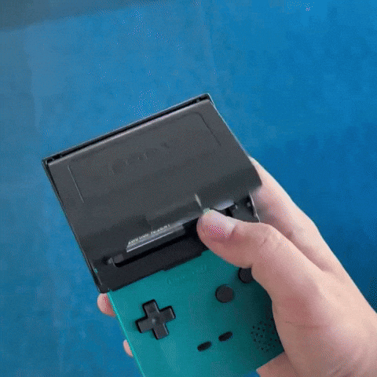

