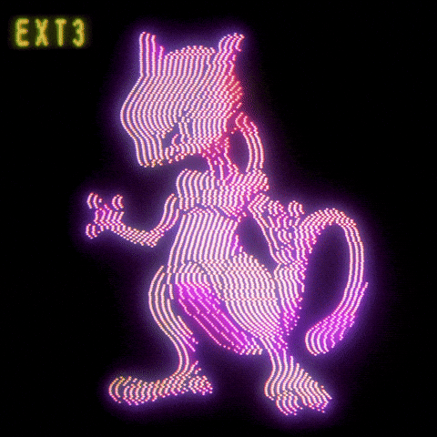

<!-- Ton GIF principal / Bannière -->

#

 

<!-- Alignement horizontal de tes GIFs Pokémon -->
<table border="0" align="center">
  <tr>
    <td align="center" style="padding: 10px;">
      
      
<i>#148 - Draco</i>

    </td>
    <td align="center" style="padding: 10px;">
      
      
<i>#004 - Salamèche</i>

    </td>
  </tr>
</table>

#

